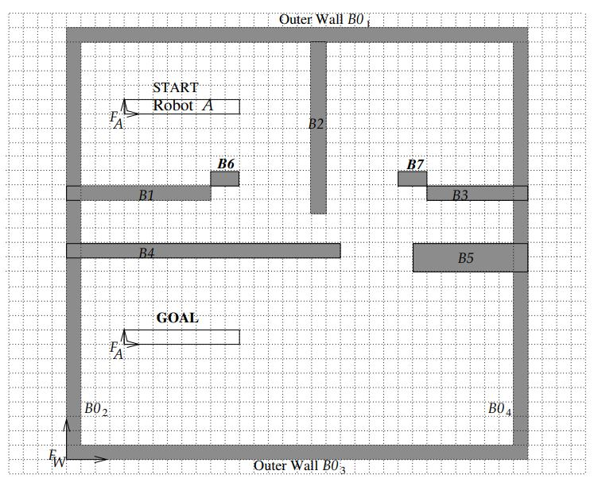

# 🤖 Robot Navigation in an Apartment using A* Search (MATLAB)

## 🧭 Overview
This project explores the use of the **A\*** search algorithm in MATLAB to navigate a robot through an apartment layout.  
Two cases were tested:

1. **Rectangular robot (offline A\*)** – full knowledge of the environment.  
2. **Disk robot (online A\*)** – discovers the environment while moving.

The goal was to compare how A\* behaves when used for **online navigation**, revealing its weaknesses when the map is not known in advance.

---

## ⚙️ What Was Done
- Using the geometry of the robot A and the apartment, find the partial C-obstalce for each angle between the robot and seperate parts of the apartment and merging for the CB with the whole room.
- Discretizing the C-obstacle into a grid of free-spaces the robot can be in for each angle from 0 to 2pi.
- Implemented the **A\*** algorithm for path planning in MATLAB.   
- Used the same **Start** and **Goal** for both robot types.  
- Ran simulations measuring path length, iterations, and computation time.  

---

## 📊 Key Findings
| Scenario | Robot Type | Knowledge | Performance |
|-----------|-------------|------------|--------------|
| Offline A* | Rectangular | Full map | Fast & efficient – under 100 iterations done in seconds |
| Online A* | Disk | Partial (online) | Very slow – 10,000+ iterations, poor response

Even with adjustments, **A\*** performs badly online because it re-plans from scratch whenever new obstacles appear.  
It’s optimal for **offline path planning**, but **not suitable for online or dynamic navigation**.

---

## 🧠 Insights
The A\* cost function is  
f(n) = g(n) + h(n),  
where g(n) is the path cost so far and h(n) is a heuristic estimate to the goal.  
In online mode, h(n) constantly becomes outdated, forcing repeated recalculations and wasted iterations.

---

## 🧰 Tools
- MATLAB (R2023a or later)  
- Simple occupancy grid map of apartment  
- Visualization of node expansion and final path  